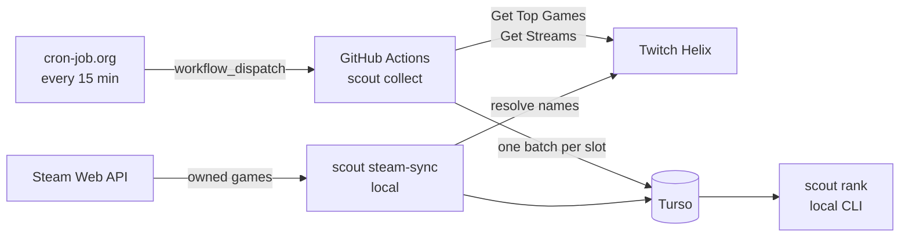
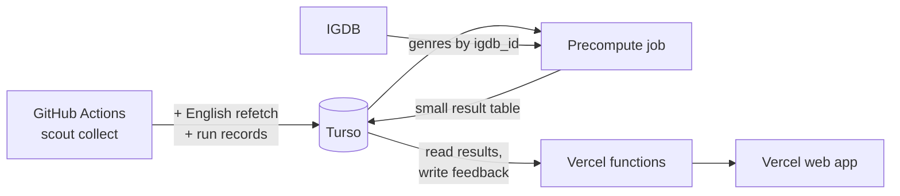

# Architecture

How the pieces fit together today and where the web app will attach.
Details live in the linked documents; this page is the map.

| Document | Covers |
| --- | --- |
| [PRODUCT.md](PRODUCT.md) | Why, for whom, scope, roadmap |
| [DATA_MODEL.md](DATA_MODEL.md) | Tables, columns, missing-data rules |
| [METHODOLOGY.md](METHODOLOGY.md) | How samples become rankings and recommendations |
| [OPERATIONS.md](OPERATIONS.md) | Running, checking, and recovering collection |
| [DECISIONS.md](DECISIONS.md) | Why things are the way they are |

## Current system

1. cron-job.org triggers the `collect` workflow every 15 minutes.
2. The collector decides the slot and tier from the clock and exits early if the slot already has a batch.
3. It reads the top N categories, then each category's live streams (up to 3 pages), and aggregates them.
4. It writes the whole batch to Turso in one transaction at the end.
5. `scout rank` reads window-tier rows and prints a ranked list.

## Code map

| Package | Responsibility |
| --- | --- |
| [twitch_scout/twitch/](../twitch_scout/twitch/) | Helix client: app token, rate limiting (token bucket), retries, bounded pagination, response validation |
| [twitch_scout/collect/](../twitch_scout/collect/) | Tier and slot resolution, the one-shot collector, extra candidate sources |
| [twitch_scout/store/](../twitch_scout/store/) | Backend selection (SQLite or Turso), migrations, snapshot and Steam tables |
| [twitch_scout/rank/](../twitch_scout/rank/) | Aggregation queries, noise guards, trend and spike, discoverability sort |
| [twitch_scout/steam/](../twitch_scout/steam/) | Steam client, name resolution tiers, library sync |
| [twitch_scout/cli.py](../twitch_scout/cli.py) | `init-db`, `collect`, `rank`, `steam-sync`; argument validation |
| [twitch_scout/config.py](../twitch_scout/config.py), [clock.py](../twitch_scout/clock.py) | Environment configuration, injectable clock |

## Engineering properties

These hold everywhere and new code keeps them (see the `coding-standards` skill):

- **Injected dependencies.** Clock, HTTP client, and database are passed in, so collection and ranking are tested against fixtures with no network and no waiting.
- **Idempotent collection.** A slot's batch is keyed by `(ts, game_id)`; re-runs overwrite rather than duplicate, and an existing batch is skipped before any API call.
- **All-or-nothing batches.** A crash mid-run leaves no partial batch.
- **Bounded work.** Every pagination loop has a page cap, every request a timeout, and retries a limit.
- **Validation at boundaries.** Helix and Steam responses are validated item by item; config values are validated where they are constructed.
- **Same SQL on both backends.** Only the portable SQLite subset is used; medians and percentiles are computed in Python.

## Planned additions

- **Collector** (roadmap step 1): de-duplicates streams, stores English and all-language distributions, refetches English streams for truncated categories within a budget, and records each run in `collect_runs`.
  See [DATA_MODEL.md](DATA_MODEL.md).
- **Precompute job**: turns raw rows into a small table of per-category results, so web requests never scan `snapshots`.
  Where it runs (a step after collection, or its own scheduled job) is decided with the web work.
  So is its shape: medians and percentiles of separate groups cannot be merged, so results precomputed per hour cannot simply be combined for an arbitrary set of stream hours.
  Candidates are precomputing for a fixed set of common schedules, or storing per-slot values compactly enough to summarize at request time.
- **Genres**: Get Top Games and Get Games return each category's `igdb_id` (an empty string when unknown), so genres come from IGDB without name matching.
  The current `HelixGame` model keeps only the id and name, so where `igdb_id` and genres are stored (a column, or a small categories table) is decided with the genre work.
- **Web app on Vercel**: a mostly static front end plus small functions that read precomputed results and store feedback.
  The collector stays on GitHub Actions; Vercel does not run collection.
  Vercel's Hobby plan is non-commercial, so monetization means moving to Pro (see [PRODUCT.md](PRODUCT.md)).

## External services

| Service | Use | Auth |
| --- | --- | --- |
| Twitch Helix | Categories and live streams | App access token (client credentials) |
| Steam Web API | Owned games for the CLI | API key in the query string; httpx request logging is silenced so it never prints |
| IGDB (planned) | Genres | Same Twitch app credentials |
| Turso | Database | Auth token |
| GitHub Actions, cron-job.org | Running and triggering collection | Repo secrets; fine-grained PAT |
| Vercel (planned) | Web app and functions | Project settings |
